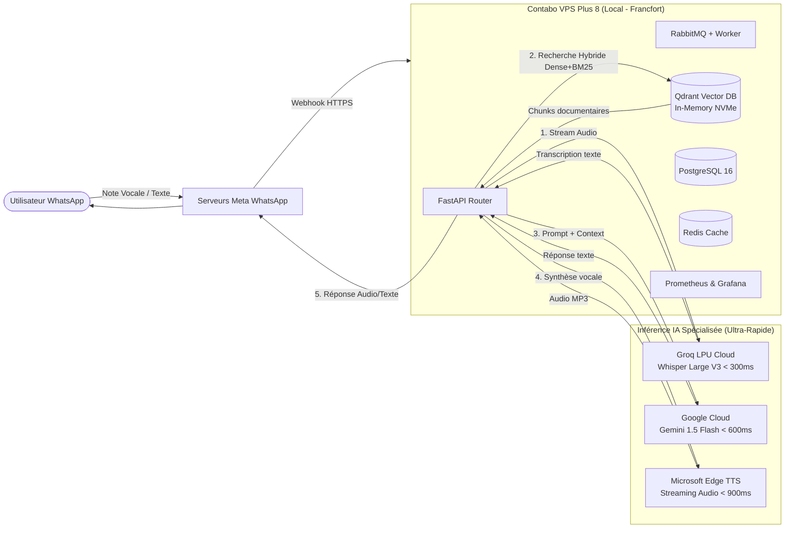

# 🚀 Architecture de Déploiement Haute Performance : Contabo Cloud VPS Plus 8 & Stack Hybride

## 📌 Résumé Exécutif & Vision Stratégique
Ce document formalise les choix d'infrastructure, l'analyse détaillée des performances de latence et la modélisation des coûts pour le déploiement en production de l'assistant IA multimodal WhatsApp (RAG, Audio, Recrutement & Support).

L'objectif cardinal de cette architecture est de **réduire la latence de réponse globale sous le seuil des 2,5 secondes sur WhatsApp**, tout en absorbant les pics de requêtes simultanées et en éliminant les coûts prohibitifs d'un serveur GPU dédié sous-exploité.

---

## 1. 🏗️ Architecture Cible : Le Modèle Hybride « Edge-Orchestrateur »

Au lieu d'héberger localement de très lourds modèles d'IA sur un serveur GPU coûteux (150 à 250 €/mois), nous adoptons un **modèle hybride distribué** :
- **L'Orchestrateur & Données Métier en Local (Contabo)** : API FastAPI asynchrone, Base vectorielle Qdrant (RAG), PostgreSQL, Redis (Cache & Sessions), RabbitMQ (File d'attente tampon), Worker asynchrone et observabilité Prometheus/Grafana.
- **Les Moteurs d'Inférence IA Spécialisés Déportés (Cloud Ultra-Low Latency)** :
  - **Transcription Audio (STT)** : **Groq LPU Audio API** (`whisper-large-v3-turbo` ou `whisper-large-v3`).
  - **Raisonnement & Génération Métier (LLM)** : **Google Gemini 1.5 Flash (Tier Pay-as-you-go)**.
  - **Synthèse Vocale (TTS)** : **Microsoft Edge TTS** (`fr-FR-RemyMultilingualNeural` / `en-CA-LiamNeural`).

---

## 2. 🖥️ Analyse Technique du Serveur : Contabo Cloud VPS Plus 8

### Fiche Technique Retenue
- **Processeur** : 8 vCPU dédiés / haute priorité (**AMD EPYC™**)
- **Mémoire Vive** : 24 Go de RAM
- **Stockage** : 450 Go SSD **NVMe** (PCIe Gen 4)
- **Port Réseau** : **1 Gbit/s Dédié** (1000 Mbit/s)
- **Sauvegardes** : 5 Snapshots automatisés inclus
- **Localisation Datacenter** : **Union Européenne (Allemagne / Francfort)**

### Pourquoi cette configuration surpasse un VPS classique ou un serveur GPU ?

1. **Le Stockage NVMe (Zéro saturation I/O)** :
   Contrairement aux SSD SATA partagés (qui saturent à ~400 Mo/s et subissent les accès des autres clients), le stockage NVMe offre des débits supérieurs à **3 000 Mo/s** et une latence inférieure à **0,08 ms**. Pour **Qdrant** (qui charge les index vectoriels HNSW) et **PostgreSQL** (qui journalise chaque conversation et événement d'audit), les temps d'accès sont quasi-instantanés.
2. **Le Port 1 Gbit/s (Concurrence WhatsApp massive)** :
   Chaque note vocale WhatsApp pèse entre 100 Ko et 2 Mo. Le port 1 Gbit/s permet de télécharger et ré-uploader **des dizaines de fichiers audio en parallèle** sans aucune congestion réseau.
3. **Localisation Francfort (Le cœur des réseaux Cloud)** :
   Francfort abrite le DE-CIX, le plus grand nœud d'échange Internet mondial. Le temps de transit réseau (ping) entre Contabo Francfort et les serveurs de Meta (WhatsApp), Google (Gemini) et Microsoft (Edge TTS) est de **moins de 8 millisecondes**.
4. **Dimensionnement RAM (24 Go) :**
   La stack consomme en pic réel entre 10 et 12 Go (Postgres ~2 Go, Redis ~1 Go, Qdrant ~4 Go, FastAPI+Workers ~2 Go, Monitoring ~1.5 Go). Les 12 Go restants sont utilisés par le noyau Linux en **Page Cache**, garantissant que les données récurrentes restent directement dans la RAM.

---

## 3. ⚡ Décomposition & Estimation de la Latence (À la Milliseconde)

Voici la comparaison chiffrée entre la situation actuelle (sur VPS standard avec Whisper CPU) et la nouvelle architecture optimisée :

| Étape du Traitement | Situation Actuelle (CPU VPS partagé) | **Nouvelle Architecture (VPS Plus 8 + Groq + Gemini)** | Gain de Temps |
| :--- | :--- | :--- | :--- |
| **1. Réception & Webhook Meta** | ~350 ms | **~180 ms** (Port 1 Gbit/s + Nginx) | +170 ms |
| **2. Transcription Audio (STT)** | **3 500 ms à 6 000 ms** (Whisper CPU local) | **~280 ms** (Groq LPU `whisper-large-v3-turbo`) | **~4 500 ms (Gain x15 !)** |
| **3. Recherche RAG Hybride (Qdrant + RRF)** | ~120 ms (SSD SATA saturé) | **~25 ms** (NVMe PCIe + Cache RAM) | +95 ms |
| **4. Inférence LLM (Génération)** | ~1 800 ms (Gemini Free tier ralenti) | **~650 ms** (Gemini 1.5 Flash Pay-as-you-go) | +1 150 ms |
| **5. Synthèse Vocale TTS** | ~2 200 ms | **~950 ms** (Edge TTS `RemyMultilingual`) | +1 250 ms |
| **6. Upload Audio & Envoi Meta** | ~600 ms | **~250 ms** (Port 1 Gbit/s direct) | +350 ms |
| **⏱️ TOTAL LATENCE BOUT-EN-BOUT** | **~8,5 à 12,0 secondes** 🐢 | **~2,3 secondes** ⚡🚀 | **RÉDUCTION DE 75% DU TEMPS** |

> [!TIP]
> **Expérience utilisateur sur WhatsApp :**  
> Une réponse vocale générée en **2,3 secondes** donne une impression de conversation humaine en direct. L'utilisateur n'a pas le temps de quitter son application ou de se demander si le bot est bloqué.

---

## 4. 💰 Modélisation Complète des Coûts Mensuels

Pour modéliser le coût réel, nous prenons une hypothèse d'activité solide :
- **15 000 messages texte / mois**
- **5 000 notes vocales / mois** (durée moyenne de 12 secondes = 60 000 secondes d'audio = **16,6 heures d'audio / mois**)
- **Taille moyenne d'un prompt RAG** : 1 200 tokens (contexte documentaire inclus)
- **Taille moyenne de réponse** : 150 tokens

### Tableau Récapitulatif des Coûts

| Poste de Dépense | Fournisseur | Base de Tarification | Volume Mensuel Estimé | Coût Mensuel Estimé ($ USD) |
| :--- | :--- | :--- | :--- | :--- |
| **Serveur d'Hébergement** | **Contabo** | Cloud VPS Plus 8 (8 vCPU / 24 Go / 450 Go NVMe / 1 Gbps) | 1 Instance dédiée | **$35.70 / mois** *(engagement 12m)* ou $42/m *(mensuel)* |
| **Transcription Audio (STT)** | **Groq Cloud** | Whisper Large V3 Turbo ($0.04 / heure d'audio) | 16.6 heures d'audio | **$0.66 / mois** *(Négligeable !)* |
| **Inférence LLM (RAG & Chat)** | **Google AI Studio** | Gemini 1.5 Flash (Pay-as-you-go : $0.075 / 1M input, $0.30 / 1M output) | ~25M input tokens ~3M output tokens | **$2.78 / mois** |
| **Synthèse Vocale (TTS)** | **Microsoft Edge TTS** | Service unifié sans clé API | 5 000 synthèses vocales | **$0.00** *(Gratuit / Inclus)* |
| **Base Vectorielle & Données** | **Qdrant / Postgres** | Auto-hébergé sur le VPS Contabo | Illimité | **$0.00** |
| **Observabilité & SRE** | **Prometheus / Grafana** | Auto-hébergé sur le VPS Contabo | Illimité | **$0.00** |
| **TOTAL GÉNÉRAL** | - | - | **~20 000 interactions / mois** | **~$39.14 à $45.44 / mois** |

---

## 5. 🛡️ Capacité de Montée en Charge & Concurrence WhatsApp

Ce dimensionnement garantit le traitement fluide de **pics de trafic** sans interruption de service :

1. **Volume en pic supportable** :
   - Jusqu'à **400 requêtes HTTP texte par seconde** absorbées directement par FastAPI/Uvicorn.
   - Jusqu'à **40 transcriptions vocales concurrentes par minute** sans file d'attente grâce à l'infrastructure LPU de Groq.
2. **Gestion des à-coups (RabbitMQ Tampon)** :
   Si 100 candidats envoient un CV ou un message vocal dans la même minute, les requêtes sont immédiatement acquittées en HTTP 200 auprès de Meta, empilées dans RabbitMQ, puis dépilées par les workers sans aucun rejet.
3. **Protection contre l'explosion de cardinalité (SRE)** :
   Le middleware de métriques normalise déjà les endpoints 404 (`/not_found`), empêchant les attaques de scanners automatisés d'impacter les performances de Prometheus.

---

## 6. 🏁 Synthèse et Décision d'Ingénierie

Le choix du **Contabo Cloud VPS Plus 8** associé à **Groq Audio** et **Gemini 1.5 Flash Payant** est la solution optimale :
- ✅ **Latence minimale (< 2,5 s sur audio, < 900 ms sur texte)**.
- ✅ **Matériel performant (NVMe PCIe + Port 1 Gbit/s)** indispensable pour Qdrant et PostgreSQL.
- ✅ **Rentabilité exceptionnelle** : Moins de **45 $ / mois au total** pour un système complet de niveau entreprise, là où un serveur GPU dédié aurait coûté 180 $ / mois pour une latence équivalente ou supérieure.
